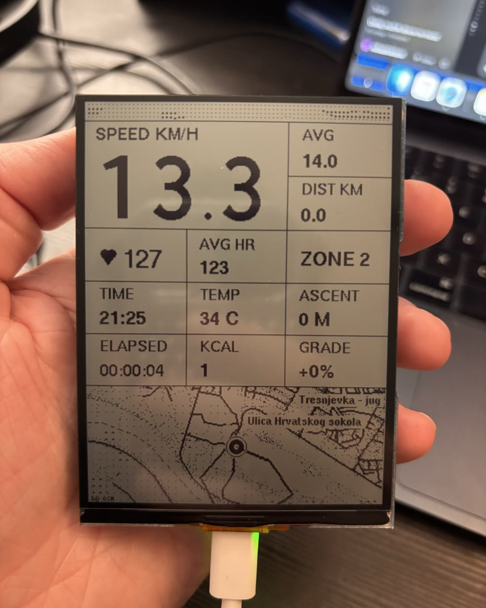

# OpenRideMirror

OpenRideMirror (ORM) is an open-source cycling companion display. A Garmin watch records the activity and sends live ride data directly to an ESP32-S3 over Bluetooth Low Energy; the ESP32 renders that data on a monochrome reflective LCD.

It is not a standalone bike computer, watch-screen mirror or workout recorder. The Garmin remains the GPS, activity and sensor hub.

**[Interface demo](https://mihaelmiklosic.github.io/OpenRideMirror/)** · **[Map builder](https://mihaelmiklosic.github.io/OpenRideMirror/map-builder.html)** · **[Complete build guide](GETTING_STARTED.md)**

> **Project status:** v0.1 developer release. A Garmin Fenix 7 and the Waveshare ESP32-S3-RLCD-4.2 have been tested together on physical hardware. Other listed Fenix 7-family targets compile, but still need community hardware testing.

<p align="center">
  
</p>

## How it works

```text
Garmin activity + ORM data field
        │  BLE GATT, ORM protocol v1
        ▼
ESP32-S3 receiver ── onboard temperature sensor
        │
        ▼
300 × 400 reflective LCD dashboard + local ride history
```

Garmin supplies activity state, GPS position, speed, distance, heart rate and zone, elevation, ascent, calories and time. The display board measures ambient temperature locally. No phone or internet connection is required while riding.

## Build it in five steps

The documented v0.1 workflow uses macOS, the exact Waveshare reference board and a supported Fenix 7-family watch.

1. Clone or download this repository and install Arduino IDE 2.x.
2. Run `./orm setup`, connect the display, then run `./orm demo` to verify the ESP32 and screen without Garmin.
3. Install Garmin Connect IQ SDK Manager and Java 17, personally accept Garmin's SDK terms, then run `./orm garmin fenix7` using the ID for your watch.
4. Run `./orm live`, copy the generated `.prg` to `GARMIN/APPS` on the watch, and add **ORM Live** as a Connect IQ data field to Bike, Walk or another activity.
5. Power the display, open that configured activity, wait for `LIVE` and GPS, then start recording.

The [complete build guide](GETTING_STARTED.md) covers exact hardware identification, tool installation, Garmin MTP transfer, activity setup, BLE behavior, custom maps and troubleshooting. No Android phone or Android app is required.

## Source layout

- `firmware/esp32/OpenRideMirror/` — ESP32 receiver, display UI, local sensor and sample map;
- `garmin/OpenRideMirror/` — Connect IQ data field that sends activity data;
- `development/` — CLI implementation, protocol checks, fixtures and tests; not required reading for the first build.

## Reference hardware and support

| Component | v0.1 status |
|---|---|
| Waveshare ESP32-S3-RLCD-4.2, SKU 33298 or 33507 | Physically tested reference display |
| Garmin Fenix 7 | Physically tested watch |
| Listed Fenix 7S, 7X and Pro variants | Compile-tested only |
| Other ESP32 displays or Garmin families | Require a documented port and hardware testing |

The reference board has a 4.2-inch 400 × 300 ST7305 reflective LCD, used here as a 300 × 400 portrait canvas, plus 16 MB flash, 8 MB PSRAM and an onboard SHTC3 temperature sensor. It is an RLCD, not an e-paper panel. See [Reference hardware](docs/hardware.md) before buying a similarly named Waveshare product.

## Important v0.1 limits

- The repository publishes source only; users build ESP32 firmware and the Garmin `.prg` locally.
- BLE is open, unauthenticated and unencrypted. It does not use a saved bond or hardcoded MAC address. See [Security](SECURITY.md).
- Maps are prepared before a ride and compiled into ESP32 flash. The display does not download map tiles while riding.
- The development board and prototype mount are not waterproof or safety-rated.
- Audio prompts, cadence, cycling power, turn-by-turn navigation and standalone activity recording are not part of v0.1.

## Documentation

For building and use:

- [Complete build guide](GETTING_STARTED.md)
- [Reference hardware](docs/hardware.md)
- [Garmin reference](docs/garmin.md)
- [Maps and attribution](docs/maps.md)
- [Troubleshooting](docs/troubleshooting.md)
- [Frequently asked questions](docs/faq.md)

For development and contribution:

- [Architecture](docs/architecture.md)
- [ORM protocol](docs/protocol.md)
- [Simulator](docs/simulator.md)
- [Porting](docs/porting.md)
- [Contributing](CONTRIBUTING.md)
- [Support](SUPPORT.md)

## License, independence and disclosure

Project code is licensed under [GPL-3.0-only](LICENSE). Third-party licenses and OpenStreetMap attribution are documented in [ATTRIBUTION.md](ATTRIBUTION.md). AI-assisted development is disclosed in [AI_USAGE.md](AI_USAGE.md).

OpenRideMirror is an independent, unofficial open-source project. It is not affiliated with, endorsed by or supported by Garmin. Garmin, Fenix and Connect IQ are trademarks of Garmin Ltd. or its subsidiaries.

Created by [Mihael Miklošić](https://mihaelmiklosic.com) · [@miha.experiments](https://www.instagram.com/miha.experiments/)
